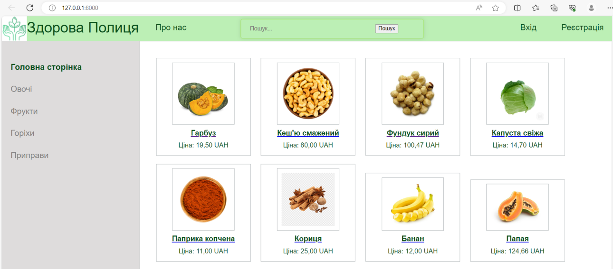
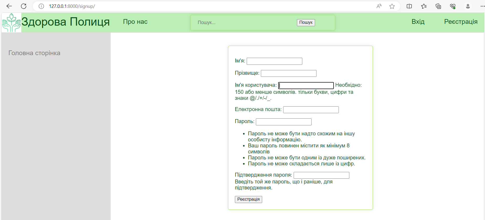
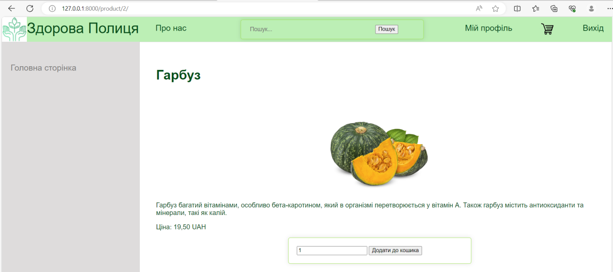
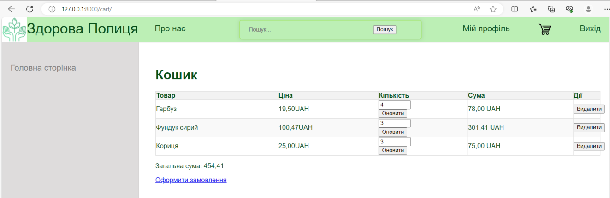
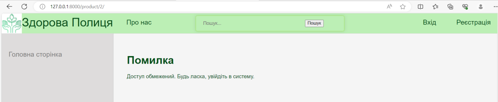

# Django Web Store Prototype

Web application prototype of an online store built using Django, HTML, CSS, and JavaScript.

---

## Overview

This project is a prototype of an e-commerce website called "Healthy Shelf", developed as part of a web development course.

The application simulates the core functionality of an online store, including product browsing, user authentication, and shopping cart management.

---

## Features

- Main page with product catalog  
- User authentication (login & registration)  
- Shopping cart system  
- Product detail pages  
- User profile with purchase history  
- Product search functionality  
- Informational pages  

---

## Technologies Used

- Python  
- Django  
- HTML  
- CSS  
- JavaScript  

---

## Architecture

The project is built using Django’s MVT (Model-View-Template) architecture:

- Model — data structure and database interaction  
- View — request handling and business logic  
- Template — UI rendering  

---

## How to Run

1. Clone the repository:
   git clone https://github.com/nadiatopikha/django-web-store-prototype.git

2. Navigate to project folder:
   cd django-web-store-prototype

3. Install dependencies:
   pip install django

4. Run migrations:
   python manage.py makemigrations  
   python manage.py migrate  

5. Start server:
   python manage.py runserver  

6. Open in browser:
   http://127.0.0.1:8000/

---

## Application Preview

  
  
  
  
  

---

## What This Project Demonstrates

- full-stack web development using Django  
- implementation of authentication systems  
- building user interfaces with HTML/CSS  
- handling user data and sessions  
- structuring web applications using MVC/MVT  

---

## 🇺🇦 Опис українською

Це прототип веб-застосунку інтернет-магазину “Здорова Полиця”, розроблений з використанням Django.

Реалізовано:
- авторизацію та реєстрацію  
- сторінки товарів  
- кошик  
- кабінет користувача  
- пошук  

Проєкт демонструє навички веб-розробки та роботи з Django.
